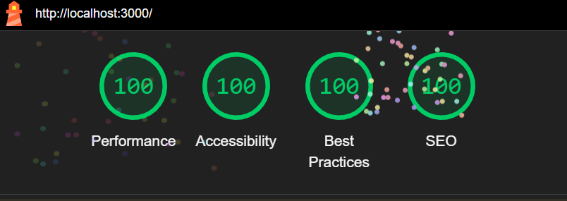

## A3 Task Manager

Server: https://glitch.com/~tall-spurious-periwinkle

## Summary
This website allows users to connect to a mongodb server and load in data about pending tasks on their todo list. Additionally, it allows you to add, edit, and delete your task data on the server. It will generate a priority depending on how close the task's deadline is to the current day.

To access all accounts use the username 'admin' with the password 'admin'

### Challenges
The biggest challenge I faced was incorporating mongodb, as I had relatively little experience working with servers before this project.

### Authentication Strategy
Due to time constraints, I decided to authenticate users by comparing their usernames and passwords to the ones in my mongodb server.

Include a very brief summary of your project here. Images are encouraged, along with concise, high-level text. Be sure to include:

### CSS Framework
I wanted to use a simple CSS framework that provided a nice contrast and that was easy to digest for color-blind people, so I decided to go with the Water.css framework.

### Express Middleware Packages
- Serve-static: I used this to help serve static files such as my html pages.
- Helmet: Helmet is a connect-style middleware that helps secure node.js applications. I use it to tell browsers to use HTTPS which is more secure than HTTP.
- Express.Json: Express.json parses incoming JSON requests and uses that information to populate the request body. I use this in my submit, edit, and delete task server functions.
- Express.urlencoded: A built-in middleware that parses some of my incoming URL-encoded requests.
- Request Logger: A custom Express middleware that is useful in development as it allows me to see what type of requests that are being sent, as well as to what URLs.

## Technical Achievements
- **Tech Achievement 1**: I got 100% on all four lighthouse tests. This works locally, but performance drops when hosted on glitch

### Design/Evaluation Achievements
- **Design Achievement 1**: I followed the following 12 tips from the W3C Web Accessibility Initiative
  1. Provided unique & informative page titles: All of my pages have unique titles that describe their purpose
  2. Use headings to convey meaning and structure: My sections have headings that describe the section
  3. Make link text meaningful: All of the buttons have descriptions
  4. Provided clear instructions
  5. Kept content clear and concise
  6. Ensure that interactive elements are easy to identify: I made sure that the buttons were darker than the background, so they would stand out
  7. I provided clear and consistent navigation options to navigate to the login page and the account creation page
  8. Ensure that form elements include clearly associated labels: My 'Add Task Form', 'Edit Task Form', 'Login Form', and 'Account Creation Form' have labels for every input
  9. Used headings and spacing to group related content, such as the 'Add Task Form' and the task list
  10. Don’t use color alone to convey information: While I use color, I also use text to convey information 
  11. Provide sufficient contrast between foreground and background: To accomplish this, I used a dark blue background which contrasts well with white text
  12. Identify page language and language changes: I indicated the primary language as english on each page
